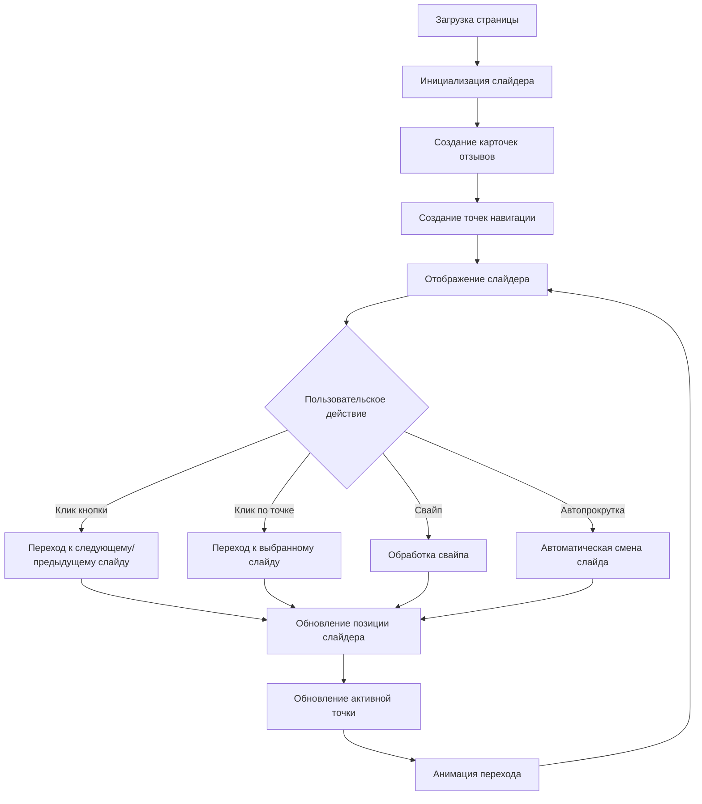

# План: Секция отзывов клиентов со слайдером

## Обзор задачи

Добавить на сайт кофейни «Четыре пончика и чашка кофе» интерактивную секцию с отзывами клиентов, реализованную в виде слайдера/карусели с возможностью прокрутки.

## Требования

### Функциональные требования
- Слайдер с отзывами клиентов
- Кнопки навигации (влево/вправо)
- Точки навигации (индикаторы)
- Автоматическая прокрутка (автоплей)
- Touch-свайп поддержка для мобильных устройств
- Плавные анимации переходов

### Визуальные требования
- Соответствие общему стилю сайта (цветовая палитра, шрифты)
- Карточки отзывов с фото клиента, именем, текстом, рейтингом и датой
- Адаптивный дизайн для разных устройств
- Hover-эффекты на кнопках и карточках

### Размещение
- Секция должна быть размещена после Галереи и перед Контактами
- Добавить ссылку на секцию в навигационное меню и футер

## Структура секции

### HTML структура
```html
<section class="reviews" id="reviews">
    <div class="section-container">
        <div class="section-header reveal">
            <span class="section-tag">Что говорят гости</span>
            <h2 class="section-title">Отзывы наших клиентов</h2>
            <p class="section-subtitle">
                Нам важно ваше мнение — читайте, что говорят о нас наши гости
            </p>
        </div>
        
        <div class="reviews-slider-container">
            <button class="slider-btn slider-btn-prev" aria-label="Предыдущий отзыв">
                <span>&#10094;</span>
            </button>
            
            <div class="reviews-slider">
                <!-- Карточки отзывов будут здесь -->
            </div>
            
            <button class="slider-btn slider-btn-next" aria-label="Следующий отзыв">
                <span>&#10095;</span>
            </button>
        </div>
        
        <div class="slider-dots">
            <!-- Точки навигации будут здесь -->
        </div>
    </div>
</section>
```

### Карточка отзыва
```html
<div class="review-card">
    <div class="review-header">
        <div class="review-avatar">
            
        </div>
        <div class="review-info">
            <h4 class="review-name">Имя клиента</h4>
            <div class="review-rating">
                <span class="star">★</span>
                <span class="star">★</span>
                <span class="star">★</span>
                <span class="star">★</span>
                <span class="star">★</span>
            </div>
        </div>
    </div>
    <p class="review-text">
        Текст отзыва клиента...
    </p>
    <div class="review-footer">
        <span class="review-date">Дата</span>
    </div>
</div>
```

## CSS стили

### Основные стили секции
```css
.reviews {
    background: var(--color-warm-cream);
    padding: 6rem 2rem;
}

.reviews-slider-container {
    position: relative;
    max-width: 1200px;
    margin: 0 auto;
    overflow: hidden;
}

.reviews-slider {
    display: flex;
    transition: transform 0.5s ease;
    gap: 2rem;
}

.review-card {
    flex: 0 0 calc(33.333% - 1.33rem);
    background: white;
    border-radius: 20px;
    padding: 2rem;
    box-shadow: var(--shadow-soft);
    transition: var(--transition-smooth);
}

.review-card:hover {
    transform: translateY(-5px);
    box-shadow: var(--shadow-hover);
}
```

### Стили карточки отзыва
```css
.review-header {
    display: flex;
    align-items: center;
    gap: 1rem;
    margin-bottom: 1.5rem;
}

.review-avatar {
    width: 60px;
    height: 60px;
    border-radius: 50%;
    overflow: hidden;
    flex-shrink: 0;
}

.review-avatar img {
    width: 100%;
    height: 100%;
    object-fit: cover;
}

.review-name {
    font-size: 1.1rem;
    color: var(--color-dark-brown);
    margin-bottom: 0.25rem;
}

.review-rating {
    color: var(--color-gold);
    font-size: 1rem;
}

.review-text {
    color: var(--color-light-brown);
    line-height: 1.7;
    margin-bottom: 1.5rem;
    font-style: italic;
}

.review-date {
    color: var(--color-accent);
    font-size: 0.85rem;
}
```

### Кнопки навигации
```css
.slider-btn {
    position: absolute;
    top: 50%;
    transform: translateY(-50%);
    width: 50px;
    height: 50px;
    border-radius: 50%;
    background: var(--color-dark-brown);
    color: var(--color-cream);
    border: none;
    cursor: pointer;
    display: flex;
    align-items: center;
    justify-content: center;
    font-size: 1.5rem;
    transition: var(--transition-smooth);
    z-index: 10;
}

.slider-btn:hover {
    background: var(--color-accent);
    transform: translateY(-50%) scale(1.1);
}

.slider-btn-prev {
    left: -25px;
}

.slider-btn-next {
    right: -25px;
}
```

### Точки навигации
```css
.slider-dots {
    display: flex;
    justify-content: center;
    gap: 0.75rem;
    margin-top: 2rem;
}

.slider-dot {
    width: 12px;
    height: 12px;
    border-radius: 50%;
    background: var(--color-light-brown);
    cursor: pointer;
    transition: var(--transition-smooth);
    opacity: 0.5;
}

.slider-dot:hover {
    opacity: 0.8;
}

.slider-dot.active {
    background: var(--color-accent);
    opacity: 1;
    transform: scale(1.2);
}
```

## JavaScript функциональность

### Основные функции
```javascript
// Инициализация слайдера
const reviewsSlider = {
    container: document.querySelector('.reviews-slider'),
    cards: document.querySelectorAll('.review-card'),
    prevBtn: document.querySelector('.slider-btn-prev'),
    nextBtn: document.querySelector('.slider-btn-next'),
    dotsContainer: document.querySelector('.slider-dots'),
    currentIndex: 0,
    cardsPerView: 3,
    autoPlayInterval: null,
    autoPlayDelay: 5000,
    isDragging: false,
    startPos: 0,
    currentTranslate: 0,
    prevTranslate: 0
};

// Функция обновления позиции слайдера
function updateSlider() {
    const cardWidth = reviewsSlider.cards[0].offsetWidth;
    const gap = 32; // 2rem в пикселях
    const translateX = -(reviewsSlider.currentIndex * (cardWidth + gap));
    reviewsSlider.container.style.transform = `translateX(${translateX}px)`;
    updateDots();
}

// Функция перехода к следующему слайду
function nextSlide() {
    const maxIndex = reviewsSlider.cards.length - reviewsSlider.cardsPerView;
    reviewsSlider.currentIndex = (reviewsSlider.currentIndex + 1) % (maxIndex + 1);
    updateSlider();
}

// Функция перехода к предыдущему слайду
function prevSlide() {
    const maxIndex = reviewsSlider.cards.length - reviewsSlider.cardsPerView;
    reviewsSlider.currentIndex = reviewsSlider.currentIndex === 0 
        ? maxIndex 
        : reviewsSlider.currentIndex - 1;
    updateSlider();
}

// Функция перехода к конкретному слайду
function goToSlide(index) {
    reviewsSlider.currentIndex = index;
    updateSlider();
}

// Функция обновления точек навигации
function updateDots() {
    const dots = document.querySelectorAll('.slider-dot');
    dots.forEach((dot, index) => {
        dot.classList.toggle('active', index === reviewsSlider.currentIndex);
    });
}

// Функция запуска автопрокрутки
function startAutoPlay() {
    reviewsSlider.autoPlayInterval = setInterval(nextSlide, reviewsSlider.autoPlayDelay);
}

// Функция остановки автопрокрутки
function stopAutoPlay() {
    clearInterval(reviewsSlider.autoPlayInterval);
}

// Touch-свайп обработчики
function touchStart(index) {
    return function(event) {
        reviewsSlider.isDragging = true;
        reviewsSlider.startPos = getPositionX(event);
        reviewsSlider.autoPlayInterval = stopAutoPlay();
    }
}

function touchMove(event) {
    if (reviewsSlider.isDragging) {
        const currentPosition = getPositionX(event);
        const currentTranslate = reviewsSlider.prevTranslate + currentPosition - reviewsSlider.startPos;
        reviewsSlider.container.style.transform = `translateX(${currentTranslate}px)`;
    }
}

function touchEnd() {
    reviewsSlider.isDragging = false;
    const movedBy = reviewsSlider.currentTranslate - reviewsSlider.prevTranslate;
    
    if (movedBy < -100) nextSlide();
    if (movedBy > 100) prevSlide();
    
    reviewsSlider.prevTranslate = reviewsSlider.currentTranslate;
    startAutoPlay();
}

function getPositionX(event) {
    return event.type.includes('mouse') ? event.pageX : event.touches[0].clientX;
}
```

## Данные отзывов

### Примеры отзывов

#### Отзыв 1
- Имя: Анна Петрова
- Рейтинг: 5 звёзд
- Текст: "Лучшая кофейня в районе! Карамельный Раф — просто невероятный. Атмосфера уютная, персонал дружелюбный. Прихожу сюда каждое утро уже полгода."
- Дата: 15 января 2025

#### Отзыв 2
- Имя: Дмитрий Иванов
- Рейтинг: 5 звёзд
- Текст: "Отличное место для работы с ноутбуком. Быстрый Wi-Fi, вкусный кофе и тишина. Пончики — это отдельная любовь, особенно с шоколадной глазурью!"
- Дата: 10 января 2025

#### Отзыв 3
- Имя: Елена Смирнова
- Рейтинг: 4 звезды
- Текст: "Очень уютная кофейня с потрясающим интерьером. Кофе всегда на высоте, но иногда бывает очередь. Рекомендую приходить утром!"
- Дата: 5 января 2025

#### Отзыв 4
- Имя: Максим Козлов
- Рейтинг: 5 звёзд
- Текст: "Флэт Уайт здесь — лучший в городе! Бариста настоящие профессионалы, знают своё дело. Цены адекватные, качество на высоте."
- Дата: 28 декабря 2024

#### Отзыв 5
- Имя: Ольга Волкова
- Рейтинг: 5 звёзд
- Текст: "Идеальное место для встреч с друзьями. Мокко Бельгийский — это просто восторг! Спасибо за тёплую атмосферу и отличный сервис."
- Дата: 20 декабря 2024

#### Отзыв 6
- Имя: Алексей Новиков
- Рейтинг: 4 звезды
- Текст: "Хорошая кофейня с приятной атмосферой. Пончики свежие, кофе вкусный. Единственное — хотелось бы больше мест для сидения."
- Дата: 15 декабря 2024

## Диаграмма потока данных



## Адаптивность

### Десктоп (≥ 968px)
- 3 карточки одновременно
- Кнопки навигации видны
- Точки навигации видны

### Планшет (768px - 967px)
- 2 карточки одновременно
- Кнопки навигации видны
- Точки навигации видны

### Мобильный (< 768px)
- 1 карточка одновременно
- Кнопки навигации видны
- Точки навигации видны
- Touch-свайп активен

## Обновление навигации

Добавить ссылку на секцию отзывов в навигационное меню:

```html
<li><a href="#reviews" class="nav-link">Отзывы</a></li>
```

И в футер:

```html
<li><a href="#reviews">Отзывы</a></li>
```

## Тестирование

1. Проверить отображение на разных размерах экрана
2. Проверить работу кнопок навигации
3. Проверить работу точек навигации
4. Проверить автопрокрутку
5. Проверить touch-свайп на мобильных устройствах
6. Проверить плавность анимаций
7. Проверить соответствие общему стилю сайта

## Порядок реализации

1. Создать HTML структуру секции отзывов
2. Добавить CSS стили для секции, карточек и слайдера
3. Добавить JavaScript для функциональности слайдера
4. Добавить примеры отзывов клиентов
5. Обновить навигацию
6. Протестировать на разных устройствах
